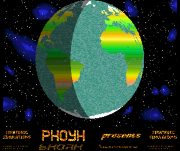
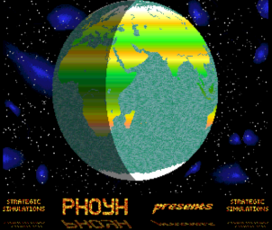

[Amiga 500](https://en.wikipedia.org/wiki/Amiga_500) demo featuring the following technical highlights:
* [Assembly](https://en.wikipedia.org/wiki/Assembly_language) programming on the [Motorola 68000](https://en.wikipedia.org/wiki/Motorola_68000) for calculating 3D-rotation of the globe.
* [Color cycling](https://en.wikipedia.org/wiki/Color_cycling) for both the ocean and the text performed during by the [vertical blank](https://en.wikipedia.org/wiki/Raster_interrupt) by the [Copper](https://en.wikipedia.org/wiki/Amiga_Original_Chip_Set#Copper).
* Text reflection waves are obtained by [sine](https://en.wikipedia.org/wiki/Sine_and_cosine) cycling during the horizontal offset. This is done by a dynamic Copper list.
* Efficient use of [bitplanes](https://en.wiktionary.org/wiki/bitplane):
	* The globe rotation is only done on the fifth bitplane in order to achieve the required speed-up. Hence, the color gradients of the continents are obtained by a static Copper list that sets the colors registers *16* to *31* to the same value.
	* Night on earth is obtained "for free" by [extra half-bright mode](https://en.wikipedia.org/wiki/Amiga_Halfbrite_mode) - the sixth bitplane is set on the left third for nighttime.
* As the *68000* is still to slow to calculate 3d-animations of this size, about half of the animation is pre-calculated initially and stored in [chip memory](https://en.wikipedia.org/wiki/Amiga_Chip_RAM). During animation, the *68000* and the [Blitter](https://en.wikipedia.org/wiki/Amiga_Original_Chip_Set#Blitter) operate in parallel. For each frame, the former calculates the remaining portion of the animation and the *Blitter* copies the precalculation into the frame.
	* This precalculation lasts about two minutes. So you need to be patient at the start.
* Background music (my original score).	




# How to Start
The easiest way is to put the repository into a mounted directory of an *emulated A500* and to invoke the *executable* which is provided for convenience.
```
cd bin
Demo
```

At the start, the precalculation of the animation lasts about two minutes. So you need to be patient.

The sources are also included. Within your *assembly IDE*, you need to assemble `src/Demo` and start it from the `src` folder (relative pathes at work...).

# Some History

I used this demo as an intro for a self-made computer game. Just in case you wonder about that *strategic simulations* stuff. Also, the bottom text morphed constantly to provide information about the game. This is also removed from this repo.

# Gallery

|  |
| :--: |
| Early version of two colors only but featuring the full globe animation |
